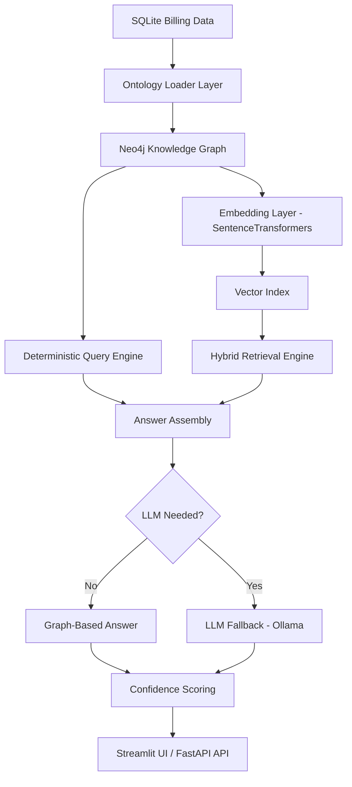
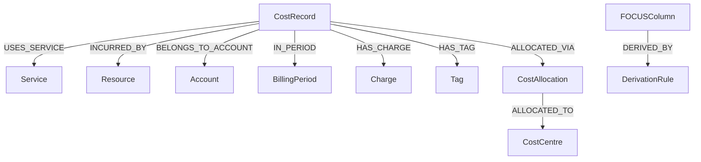
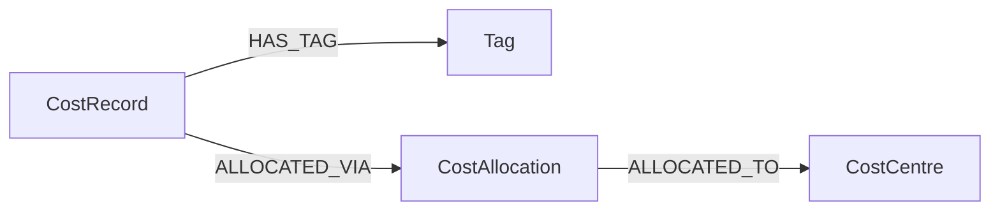

# ☁️ Cloud Cost Knowledge Graph + Hybrid RAG Engine

### Ontology-Driven Cloud Billing Intelligence System (FOCUS-Aligned)

---

## 📌 Executive Summary

This project implements a **production-style ontology-driven Cloud Cost Intelligence system** aligned with the **FOCUS (FinOps Open Cost & Usage Specification)** standard.

The system is designed to prioritize:

* ✅ Deterministic financial correctness
* ✅ Explainability & provenance tracing
* ✅ Cross-cloud normalization
* ✅ Controlled LLM usage (never for cost math)
* ✅ Production-ready architecture

Unlike LLM-only systems, **all financial calculations are executed deterministically inside the graph** using Cypher queries.

The LLM (Ollama) is used only as an optional explanation fallback.

---

# 🏗 High-Level Architecture



---

# 🧠 System Layers

| Layer              | Responsibility                                 |
| ------------------ | ---------------------------------------------- |
| Data Layer         | AWS & Azure billing ingestion                  |
| Ontology Layer     | FOCUS-aligned semantic modeling                |
| Graph Layer        | Explicit cost, charge, allocation modeling     |
| Retrieval Layer    | Hybrid graph + vector retrieval                |
| Reasoning Layer    | Deterministic Cypher + controlled LLM fallback |
| Presentation Layer | Streamlit UI + REST API                        |
| Evaluation Layer   | Confidence scoring + query logging             |

---

# 🧠 Ontology Design

All billing semantics are modeled explicitly as graph entities.

## Core Nodes

* `CostRecord`
* `Service`
* `Resource`
* `Account`
* `BillingPeriod`
* `Charge`
* `Tag`
* `CostAllocation`
* `CostCentre`
* `FOCUSColumn`
* `DerivationRule`

---

## Ontology Graph Structure



This ensures:

* Traceable cost logic
* Vendor normalization
* Allocation transparency
* Future extensibility

---

# 📘 FOCUS Standard Alignment

FOCUS columns are modeled as first-class semantic nodes:

```cypher
(FOCUSColumn {
  name,
  description,
  dataType,
  nullable,
  validationRule,
  standard: "FOCUS 1.0"
})
```

Vendor normalization:

```cypher
(AWSColumn)-[:MAPS_TO]->(FOCUSColumn)
(AzureColumn)-[:MAPS_TO]->(FOCUSColumn)
```

---

# 🧮 Explicit Derivation Modeling

Example:

```
EffectiveCost = BilledCost + AmortizedCost
```

Modeled as:

```cypher
(FOCUSColumn)-[:DERIVED_BY]->(DerivationRule)
```

This enables:

* Transparent cost derivation
* Explainable financial logic
* Extensible rule definitions

---

# 🧾 Cost Allocation Modeling

Allocation is explicitly represented:



Characteristics:

* Tag-driven
* Proportional allocation
* Derived from EffectiveCost
* Fully auditable

---

# 🔎 Hybrid Retrieval Strategy

| Scenario                 | Engine Used         |
| ------------------------ | ------------------- |
| Cost aggregation         | Deterministic Graph |
| Commitment filtering     | Deterministic Graph |
| Billing period filtering | Deterministic Graph |
| Cross-cloud comparison   | Deterministic Graph |
| Schema explanation       | Hybrid              |
| Concept definition       | Hybrid              |
| Out-of-schema question   | LLM fallback        |

---

# 📊 Deterministic vs LLM Separation

| Component                    | Uses LLM? |
| ---------------------------- | --------- |
| Cost math                    | ❌         |
| Commitment filtering         | ❌         |
| Aggregation                  | ❌         |
| Allocation logic             | ❌         |
| Schema explanation           | Optional  |
| Natural language explanation | Optional  |

This prevents hallucinated financial values.

---

# 📈 Confidence Scoring

Confidence is computed using:

* Intent type
* Provenance path count
* Retrieval method
* LLM penalty (if used)

Graph-only answers → Higher confidence
LLM fallback → Slight confidence reduction

---

# 🔍 Provenance Example

Each answer returns explicit graph paths:

```
CostRecord → IN_PERIOD(2024-01)
CostRecord → HAS_CHARGE(Usage)
```

This ensures auditability.

---

# 📝 Evaluation Logging

Each query logs:

* Query text
* Intent
* Retrieval method
* Billing period
* Provenance count
* Confidence
* Timestamp

Stored in:

```
evaluation_log.json
```

---

# 🚀 How to Run

## 1️⃣ Install Dependencies

```bash
pip install -r requirements.txt
```

## 2️⃣ Configure Environment

Create `.env`:

```
NEO4J_PASSWORD=your_password_here
```

## 3️⃣ Start Neo4j

Ensure running at:

```
bolt://127.0.0.1:7687
```

Test:

```python
from graph.neo4j_connection import driver
with driver.session(database="neo4j") as s:
    print(s.run("RETURN 1").single())
```

## 4️⃣ Create Demo DB

```bash
python setup_demo_db.py
```

## 5️⃣ Load Ontology

```bash
python -m graph.focus_schema_loader
```

## 6️⃣ Load Cost Records

```bash
python -m graph.cost_record_loader
```

## 7️⃣ Launch UI

```bash
streamlit run app.py
```

---

# 🌐 REST API (Optional)

Start API:

```bash
uvicorn api:app --reload
```

Visit:

```
http://127.0.0.1:8000/docs
```

---

# 🤖 Optional: Enable LLM Fallback

Install Ollama:

[https://ollama.com](https://ollama.com)

Run:

```bash
ollama serve
ollama run phi
```

System remains fully functional without LLM.

---

# 💻 Hardware Notes

Minimum:

* 8GB RAM → Graph-only mode
* 16GB RAM → LLM enabled

LLM is optional.

---

# 🛠 Troubleshooting

| Issue         | Solution             |
| ------------- | -------------------- |
| Neo4j refused | Ensure Neo4j running |
| LLM error     | Run `ollama serve`   |
| CUDA error    | Use CPU mode         |
| Missing DB    | Run setup_demo_db.py |

---

# 🔬 Future Research Extensions

* Semantic query planner
* NL → Cypher translator
* Multi-hop reasoning engine
* Graph anomaly detection
* Cost forecasting
* RBAC enforcement

---

# 🎯 What This Demonstrates

* Ontology engineering
* Graph-native cost reasoning
* Hybrid retrieval design
* Deterministic financial logic
* Commitment-aware filtering
* Allocation traceability
* Confidence-scored explainability
* Production-grade system separation

---

# 🏁 This system prioritizes:

* Financial correctness
* Ontological clarity
* Explainable AI principles
* Production realism
* Extensibility for enterprise FinOps workflows

It serves as a foundation for scalable, explainable Cloud Cost Intelligence platforms.

---
