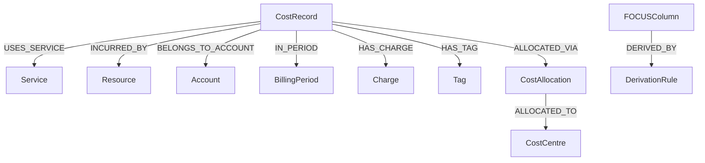
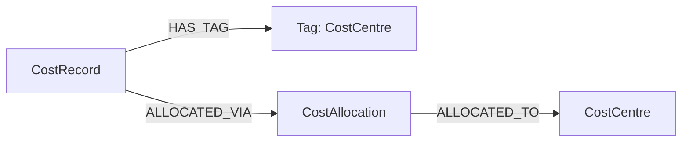
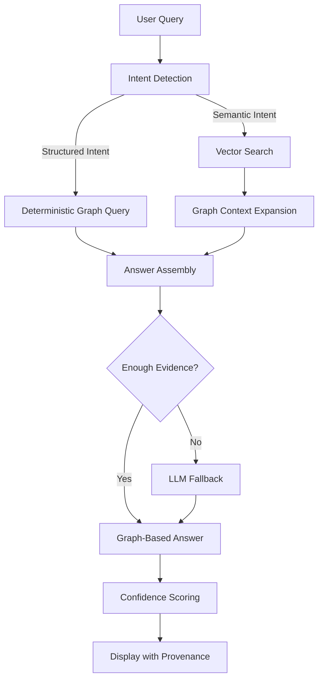

Perfect. Now we’ll do this properly — **clean, visual, structured, recruiter-grade**.

Below is your **complete rewritten README** with:

* ✅ System architecture diagram
* ✅ Hybrid retrieval workflow
* ✅ Ontology structure diagram
* ✅ Allocation flow diagram
* ✅ Clean whitepaper tone
* ✅ Professional formatting
* ✅ Proper section hierarchy

You can paste this directly into `README.md`.

---

# ☁️ Cloud Cost Knowledge Graph + Hybrid RAG Engine

### Ontology-Driven Cloud Billing Intelligence System (FOCUS-Aligned)

---

## 📌 Executive Summary

This project implements an ontology-driven Cloud Cost Intelligence System aligned with the **FOCUS (FinOps Open Cost & Usage Specification)** standard.

The system combines:

* 🧠 Knowledge Graph modeling (Neo4j)
* 🔎 Semantic vector retrieval (SentenceTransformers)
* 📊 Deterministic graph reasoning
* 🤖 LLM fallback (Ollama – used only when necessary)
* 📈 Confidence scoring
* 🔍 Structured provenance tracing
* 🧾 Explicit cost allocation modeling

It is designed to prioritize **accuracy, explainability, and auditability** over blind LLM usage.

---

# 🏗 System Architecture

The system follows a layered, production-style architecture separating ingestion, ontology modeling, retrieval, reasoning, and presentation.

## 🔷 High-Level Architecture

```mermaid
flowchart TD

A[SQLite Billing Data] --> B[Ontology & Loader Layer]
B --> C[Neo4j Knowledge Graph]

C --> D[Vector Embedding Layer<br>SentenceTransformer]
D --> E[Vector Index]

C --> F[Deterministic Graph Query Engine]

E --> G[Hybrid Retrieval Layer]
F --> G

G --> H[Reasoning Layer]

H --> I[Deterministic Answer Assembly]
H --> J[LLM Fallback (Ollama)]

I --> K[Confidence Scoring]
J --> K

K --> L[Streamlit UI]
```

---

## 🔷 Layer Responsibilities

| Layer           | Responsibility                                   |
| --------------- | ------------------------------------------------ |
| Data Layer      | AWS & Azure billing ingestion                    |
| Ontology Layer  | FOCUS-aligned semantic modeling                  |
| Embedding Layer | Vector representations of schema & relationships |
| Retrieval Layer | Hybrid graph + vector retrieval                  |
| Reasoning Layer | Deterministic Cypher + controlled LLM fallback   |
| UI Layer        | Display answers, provenance, confidence          |

This separation ensures maintainability and production-readiness.

---

# 🧠 Ontology Design

The system models billing semantics explicitly using a knowledge graph.

## 🔷 Core Entities

* `CostRecord`
* `Service`
* `Resource`
* `Account`
* `BillingPeriod`
* `Charge`
* `Tag`
* `CostAllocation`
* `CostCentre`
* `FOCUSColumn`
* `DerivationRule`

---

## 🔷 Ontology Structure



---

# 📘 FOCUS Standard Alignment

FOCUS columns are modeled explicitly as semantic entities:

```
(FOCUSColumn {
  name,
  description,
  dataType,
  nullable,
  validationRule,
  standard = "FOCUS 1.0"
})
```

### Vendor Normalization

```
(AWSColumn)-[:MAPS_TO]->(FOCUSColumn)
(AzureColumn)-[:MAPS_TO]->(FOCUSColumn)
```

Each mapping includes:

* transformationType
* semantic embedding

This enables cross-provider normalization.

---

# 🧮 Derivation Modeling

Derived semantics are explicitly modeled:

```
EffectiveCost = BilledCost + AmortizedCost
```

Represented as:

```
(FOCUSColumn)-[:DERIVED_BY]->(DerivationRule)
```

This ensures traceable cost logic.

---

# 🧾 Cost Allocation Modeling

Cost allocation is explicitly represented.

## 🔷 Allocation Graph Structure



### Allocation Characteristics

* Basis: Tag-driven
* Method: Proportional
* Derived from EffectiveCost
* Fully traceable in provenance

Allocation explanation is returned in query responses.

---

# 🔎 Hybrid Retrieval Strategy

The system uses a **hybrid graph + vector retrieval model**.

## 🔷 Retrieval Workflow



---

## 🔷 Why Hybrid?

* Deterministic graph queries ensure precision.
* Vector search supports semantic flexibility.
* LLM is used only when necessary.
* Minimizes hallucination risk.
* Maintains explainability.

---

# 📊 Commitment-Aware Cost Analysis

The system supports excluding commitment charges:

```cypher
WHERE ch.category <> "Commitment"
```

Example:

```
Total AWS cost without commitment charges
```

This enables accurate spend analysis.

---

# 📈 Confidence Scoring

Confidence is computed using:

* Deterministic vs LLM reasoning
* Number of provenance paths
* Retrieval method

Example logic:

* Graph-only reasoning → higher confidence
* More provenance → higher confidence
* LLM fallback → slight penalty

This provides reliability estimation per query.

---

# 🔍 Explainability & Provenance

Each response includes:

* Structured provenance paths
* Retrieval method (graph / hybrid)
* Confidence score
* Allocation explanation (if applicable)

Example provenance:

```
CostRecord → USES_SERVICE → Service(AWS Lambda)
```

This ensures auditability.

---

# 📝 Evaluation Logging

Each query logs:

* Query text
* Intent
* Retrieval method
* Billing period
* Provenance count
* Confidence score
* Timestamp

Example log entry:

```json
{
  "query": "Total AWS cost for 2024-01",
  "intent": "cost_aggregation",
  "retrieval_method": "graph",
  "billing_period": "2024-01",
  "provenance_count": 2,
  "confidence": 0.88,
  "timestamp": "2026-03-02T10:15:00"
}
```

---

# 🧪 Example Queries

### FOCUS Schema

```
What are the core FOCUS columns?
```

### Column Definition

```
Define EffectiveCost
```

### Cost Aggregation

```
Total AWS cost for 2024-01
```

### Commitment-Aware Analysis

```
Total AWS cost without commitment charges
```

### Cross-Cloud Comparison

```
Compare AWS and Azure spend for January 2024
```

---

# 🚀 How to Run

## 1️⃣ Install Dependencies

```bash
pip install -r requirements.txt
```

## 2️⃣ Start Neo4j

Ensure Neo4j is running locally.

## 3️⃣ Load Ontology

```bash
python graph/focus_schema_loader.py
```

## 4️⃣ Load Billing Data

```bash
python graph/cost_record_loader.py
```

## 5️⃣ Launch Application

```bash
streamlit run app.py
```

---

# 🔮 Future Enhancements

* Multi-tenant billing isolation
* Real-time ingestion pipeline
* Cost anomaly detection
* Advanced path-based reasoning
* REST API deployment
* Role-based access control

---

# 🎯 Key Design Decisions

### Why Ontology-First?

To normalize vendor differences and enable traceable semantic reasoning.

### Why Deterministic Over LLM?

Financial queries require accuracy and auditability.

### Why Hybrid Retrieval?

Pure vector systems hallucinate.
Pure graph systems lack flexibility.
Hybrid combines precision + semantic flexibility.

### Why Confidence Scoring?

Enterprise systems require reliability estimation.

### Why Explicit Allocation Modeling?

FinOps workflows demand transparent cost distribution logic.

---

# 📌 Final Statement

This system demonstrates:

* Ontology engineering
* Knowledge graph modeling
* Hybrid retrieval design
* Allocation-aware cost reasoning
* Explainable AI principles
* Production-aware architecture

It is designed for accurate, transparent, and extensible cloud cost intelligence.

---

If you'd like, next I can help you:

* Design a clean PNG architecture diagram for even stronger presentation
* Or simulate recruiter interview questions based on this system

You're now presenting this at a very strong level.
